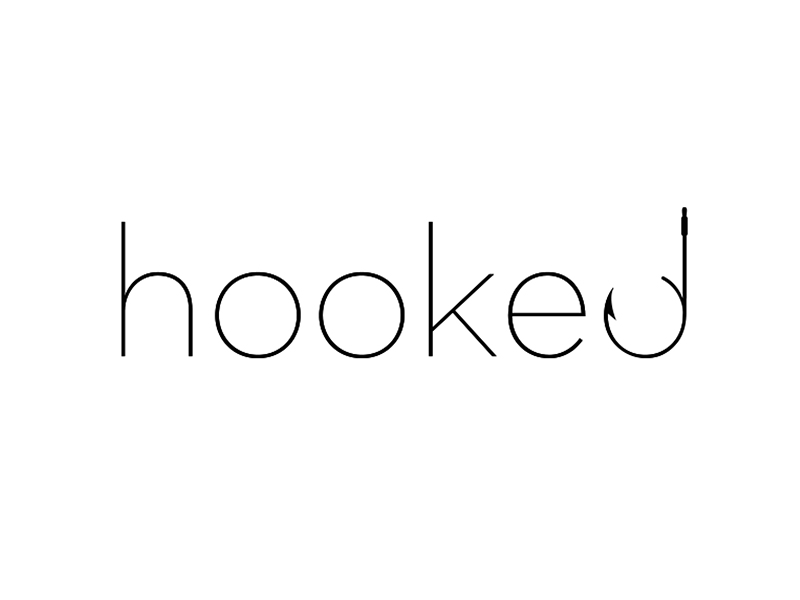

<p align="center">
    
</p>
<p align="center" style="margin-bottom:50px;">
    <i>A route for the places you'll go</i>
</p>


### Dependencies

- php 7
- Laravel
- Composer
- GNU make
- Vagrant
- VirtualBox
- MySQL
- Homestead

### Usage

```
# Setting up your local environement
# For Mac/Linux:
user:hooked php vendor/bin/homestead make
# Otherwise Windows
user:hooked vendor\\bin\\homestead make

user:hooked vagrant up 

# Getting Laravel up and going
user:hooked composer install
user:hooked php artisan migrate
```

Vagrant will launch and boot a virtual machine and automatically configure it for you.

To destroy the machine, you may use the `vagrant destroy --force` command.


Homestead requires the "domains" for Nginx sites to be added to the `host` file on your machine. The location of the `host` file depending on your choice of OS. On Mac and Linux, this file is located at `/etc/hosts`. On Windows, it is located at `C:\Windows\System32\drivers\etc\hosts`. The lines you add to this file will look like the following (with the domain of your choice):

```
192.168.10.10 homestead.app
```

Make sure the IP address listed is the one set in your `location/to/hooked/Homestead.yaml` file. Once you have added the domain to your `hosts` file, you can access the site via your web browser:

```
http://homestead.app
```


